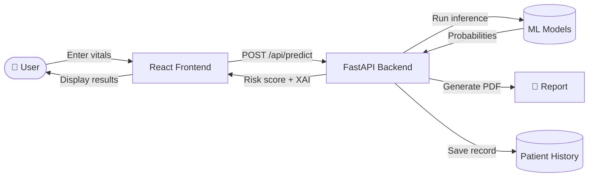
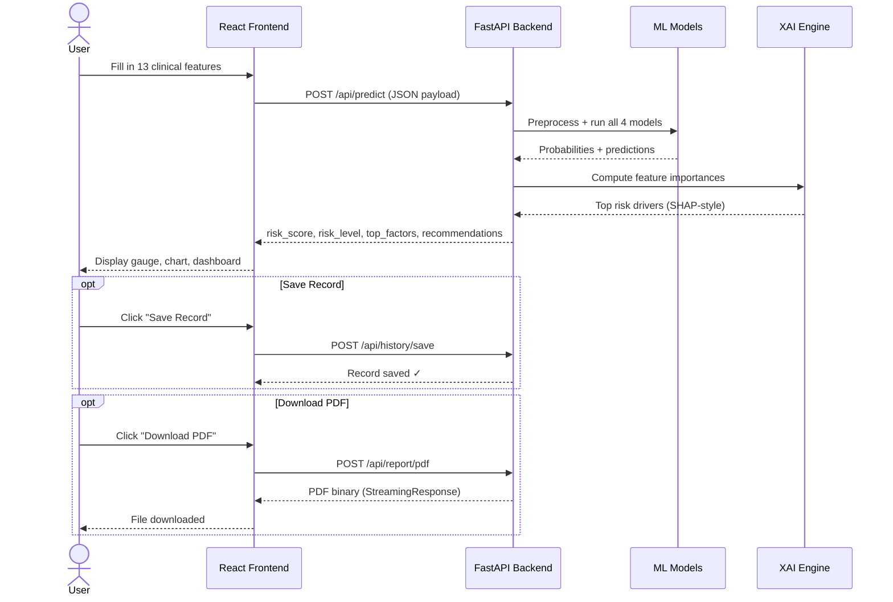
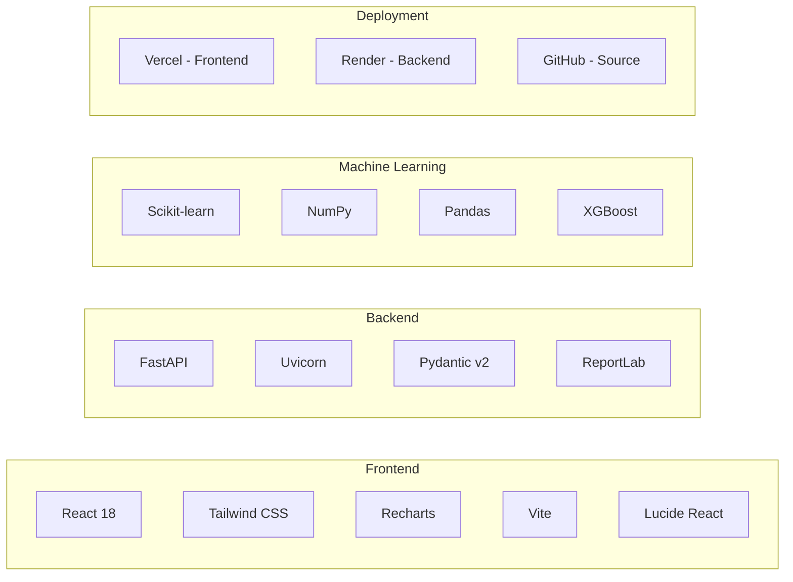
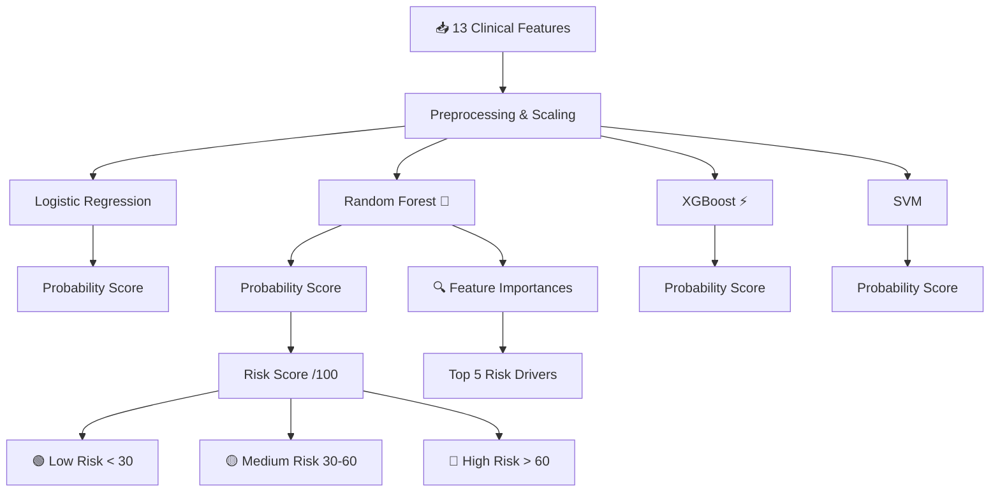
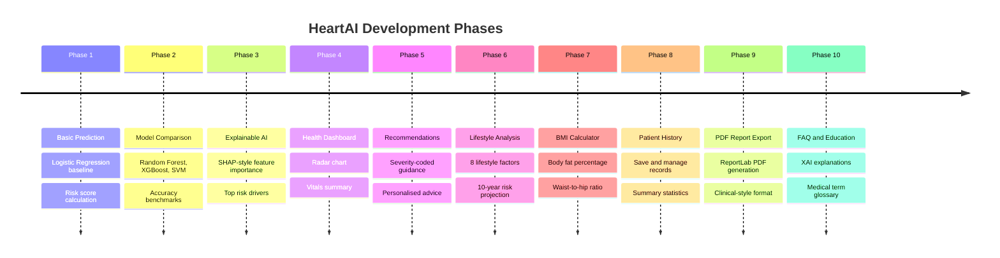
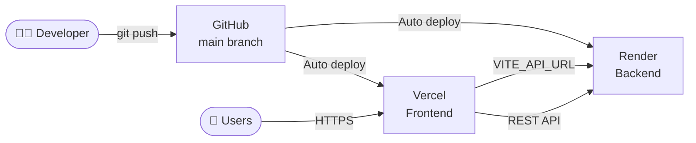

<div align="center">

# 🫀 HeartAI

### Explainable AI-Based Heart Disease Prediction & Risk Analysis System

[](https://python.org)
[](https://fastapi.tiangolo.com)
[](https://react.dev)
[](https://tailwindcss.com)
[](https://vitejs.dev)
[](LICENSE)

> **"Development of an Explainable AI-Based Heart Disease Prediction and Risk Analysis System"**  
> A full-stack ML project — built for academic, portfolio, and internship use.

[Live Demo](#https://heart-ai-three.vercel.app/) · [API Docs](#api-documentation) · [Report Bug](issues) · [Request Feature](issues)

</div>

---

## 📋 Table of Contents

- [Overview](#-overview)
- [Features](#-features)
- [System Architecture](#-system-architecture)
- [Tech Stack](#-tech-stack)
- [Project Structure](#-project-structure)
- [Getting Started](#-getting-started)
- [API Documentation](#-api-documentation)
- [ML Models](#-ml-models)
- [Project Phases](#-project-phases)
- [Deployment](#-deployment)
- [Screenshots](#-screenshots)
- [Author](#-author)

---

## 🔍 Overview

HeartAI is a full-stack web application that predicts the likelihood of heart disease using classical machine learning models and provides **explainable AI (XAI)** insights — showing *which* factors drove the prediction, not just the result.

Users input clinical vitals (blood pressure, cholesterol, heart rate, etc.), and the system returns a risk score, risk classification, feature importance chart, personalised recommendations, and a downloadable PDF report.



---

## ✨ Features

| Feature | Description |
|---|---|
| 🧠 **Heart Disease Prediction** | 4 ML models — Logistic Regression, Random Forest, XGBoost, SVM |
| 📊 **Model Comparison** | Side-by-side accuracy benchmarks for all models |
| 🔍 **Explainable AI (XAI)** | SHAP-style feature importance showing top risk drivers |
| 📈 **Health Dashboard** | Radar chart, pie chart, and vitals summary |
| 💊 **Personalised Recommendations** | Severity-coded health guidance based on your vitals |
| 🏃 **Lifestyle Analysis** | 8 lifestyle factors + 10-year risk projection |
| ⚖️ **BMI Calculator** | BMI, body fat %, WHR, ideal weight range, cardiac risk correlation |
| 🗂️ **Patient History** | Save, view, and delete patient prediction records |
| 📄 **PDF Report Export** | Downloadable clinical-style PDF report via ReportLab |
| ❓ **FAQ & Education** | Plain-language explanations of AI methods and medical terms |

---

## 🏗️ System Architecture

```mermaid
graph TB
    subgraph Frontend ["🖥️ Frontend (React + Vite)"]
        UI[User Interface]
        Pages[Pages: Predict, Results, Compare, Lifestyle, BMI, History, FAQ, About]
        Components[Components: RiskGauge, ShapChart, HealthDashboard, Recommendations]
        APIClient[api.js - Axios/Fetch Client]
    end

    subgraph Backend ["⚙️ Backend (FastAPI)"]
        Router[API Router - main.py]
        P[/api/predict]
        C[/api/compare]
        L[/api/lifestyle]
        B[/api/bmi]
        H[/api/history]
        R[/api/report]
    end

    subgraph ML ["🤖 ML Layer (Scikit-learn)"]
        LR[Logistic Regression]
        RF[Random Forest ⭐]
        XG[XGBoost]
        SVM[SVM]
        XAI[XAI: Feature Importances]
    end

    subgraph Storage ["💾 Storage"]
        JSON[(patient_history.json)]
        PDF[PDF via ReportLab]
    end

    UI --> Pages --> APIClient
    APIClient -->|HTTP REST| Router
    Router --> P & C & L & B & H & R
    P & C --> ML
    ML --> LR & RF & XG & SVM
    RF --> XAI
    H --> JSON
    R --> PDF
```

---

## 🔄 Prediction Flow



---

## 🛠️ Tech Stack



| Layer | Technology | Version |
|---|---|---|
| Frontend Framework | React | 18 |
| Styling | Tailwind CSS | 3 |
| Charts | Recharts | latest |
| Build Tool | Vite | 5 |
| Backend Framework | FastAPI | 0.111 |
| ML Library | Scikit-learn | 1.4.2 |
| Data Processing | NumPy + Pandas | 1.26.4 / 2.2.2 |
| PDF Generation | ReportLab | 4.2.0 |
| Runtime | Python | 3.11 |
| Frontend Deploy | Vercel | — |
| Backend Deploy | Render | — |

---

## 📁 Project Structure

```
heartai/
│
├── 📁 backend/
│   ├── main.py                  # FastAPI app entry point + CORS
│   ├── requirements.txt         # Python dependencies
│   ├── runtime.txt              # Python 3.11.9 (for Render)
│   └── routes/
│       ├── predict.py           # /api/predict — ML inference + XAI
│       ├── compare.py           # /api/compare — model benchmarks
│       ├── lifestyle.py         # /api/lifestyle — lifestyle risk
│       ├── bmi.py               # /api/bmi — BMI calculator
│       ├── history.py           # /api/history — patient records
│       └── report.py            # /api/report — PDF generation
│
└── 📁 frontend/
    ├── index.html
    ├── package.json
    ├── vite.config.js           # Dev proxy → localhost:8000
    ├── tailwind.config.js
    └── src/
        ├── main.jsx
        ├── App.jsx              # Route wiring + state management
        ├── index.css            # Global styles + CSS vars
        ├── utils/
        │   └── api.js           # All API calls + downloadReport
        ├── components/
        │   ├── Sidebar.jsx
        │   ├── RiskGauge.jsx    # Circular risk score gauge
        │   ├── ShapChart.jsx    # Horizontal bar XAI chart
        │   ├── ModelComparison.jsx
        │   ├── HealthDashboard.jsx
        │   └── Recommendations.jsx
        └── pages/
            ├── PredictPage.jsx
            ├── ResultsPage.jsx
            ├── LifestylePage.jsx
            ├── BMIPage.jsx
            ├── HistoryPage.jsx
            ├── FAQPage.jsx
            └── AboutPage.jsx
```

---

## 🚀 Getting Started

### Prerequisites

- Python 3.11+
- Node.js 18+
- npm or yarn

### 1. Clone the repository

```bash
git clone https://github.com/Senior19/heart-ai.git
cd heart-ai
```

### 2. Backend setup

```bash
cd backend

# Create and activate virtual environment
python -m venv venv
source venv/bin/activate        # Mac/Linux
venv\Scripts\activate           # Windows

# Install dependencies
pip install -r requirements.txt

# Start the backend server
uvicorn main:app --reload --port 8000
```

Backend will be running at `http://localhost:8000`  
API docs available at `http://localhost:8000/docs`

### 3. Frontend setup

```bash
# In a new terminal
cd frontend

# Install dependencies
npm install

# Start the dev server
npm run dev
```

Frontend will be running at `http://localhost:5173`

---

## 📡 API Documentation

### Health Check
```
GET /api/health
→ { "status": "ok", "version": "2.0.0" }
```

### Predict Heart Disease
```
POST /api/predict/
Body: {
  age, gender, chest_pain_type, resting_bp,
  cholesterol, fasting_bs, resting_ecg,
  max_heart_rate, exercise_angina,
  st_depression, st_slope, vessels_colored,
  thalassemia, model_choice
}
→ { risk_score, risk_level, probability, top_factors, recommendations, model_used }
```

### Compare Models
```
POST /api/compare/
Body: { same as predict }
→ [ { model, accuracy, prediction, probability } ]
```

### BMI Calculator
```
POST /api/bmi/calculate
Body: { weight_kg, height_cm, age, gender, waist_cm, hip_cm }
→ { bmi, category, body_fat_percent, ideal_weight_range, cardiac_risk }
```

### Patient History
```
POST /api/history/save       → save a record
GET  /api/history/all        → fetch all records
DELETE /api/history/{id}     → delete one record
DELETE /api/history/clear/all → clear all records
```

### PDF Report
```
POST /api/report/pdf
Body: { patient_name, age, gender, risk_score, risk_level,
        cholesterol, resting_bp, max_heart_rate, st_depression,
        vessels_colored, top_factors, recommendations }
→ application/pdf (StreamingResponse)
```

---

## 🤖 ML Models



### Input Features

| # | Feature | Description |
|---|---|---|
| 1 | Age | Patient age in years |
| 2 | Gender | Male / Female |
| 3 | Chest Pain Type | Typical angina, atypical, non-anginal, asymptomatic |
| 4 | Resting BP | Resting blood pressure (mmHg) |
| 5 | Cholesterol | Serum cholesterol (mg/dL) |
| 6 | Fasting Blood Sugar | > 120 mg/dL (boolean) |
| 7 | Resting ECG | Normal / ST abnormality / LV hypertrophy |
| 8 | Max Heart Rate | Maximum heart rate achieved |
| 9 | Exercise Angina | Exercise-induced angina (boolean) |
| 10 | ST Depression | ST depression induced by exercise |
| 11 | ST Slope | Slope of peak exercise ST segment |
| 12 | Vessels Colored | Number of major vessels (0–3) |
| 13 | Thalassemia | Normal / Fixed defect / Reversible defect |

---

## 📦 Project Phases



---

## ☁️ Deployment



| Service | Platform | URL |
|---|---|---|
| Frontend | Vercel | `https://heartai.vercel.app` |
| Backend | Render | `https://heart-ai-api.onrender.com` |

### Environment Variables

**Vercel (Frontend):**
```
VITE_API_URL = https://heart-ai-api.onrender.com/api
```

**Render (Backend):**
```
No env vars required — uses requirements.txt + runtime.txt
```

---

## ⚠️ Disclaimer

> This system is built for **educational and research purposes only**.  
> It is **not** a substitute for professional medical advice, diagnosis, or treatment.  
> Always consult a qualified healthcare provider for any medical decisions.  
> The dataset used is a synthetic variant of the Cleveland Heart Disease (UCI) dataset.

---

## 👨‍💻 Author

<div align="center">

### Ashish Kumar Jha

**ML Enthusiast & Backend Developer**

Passionate about building intelligent, explainable systems that solve real-world problems.
Designed and developed HeartAI end-to-end — from training the ML models and crafting the FastAPI backend
to building a clean, interactive React frontend.

[](https://github.com/Senior19)

</div>

---

<div align="center">

Made with ❤️ by **Ashish Kumar Jha**  
⭐ Star this repo if you found it useful!

</div>
